# Folder Sync 项目全面代码审查报告

> 审查日期：2026-08-16
> 审查范围：全项目代码（Core 层、UI 层、应用壳层）、工程配置（csproj、.gitignore）、Markdown 文档（CLAUDE.md、.trae/specs、.trae/documents）
> 验证方式：全部 16 项问题经两个独立子代理交叉验证确认

---

## Phase 1：架构评估

### 1.1 技术栈总览

| 层次 | 选型 |
|------|------|
| 框架 | .NET 8 + WPF（MVVM 自研轻量实现） |
| UI | MaterialDesignThemes 5.3.1 |
| 协议层 | System.IO（Local/SMB）+ FluentFTP 54.1.1 |
| 调度 | Quartz.NET 3.18.0（非持久化 JobStore） |
| 日志 | Serilog（每实例独立 .log） |
| 哈希 | System.IO.Hashing（xxHash64） |
| 状态存储 | Microsoft.Data.Sqlite 8.0.8（双向基线 + 单向投递状态） |
| 凭据保护 | Windows DPAPI（CurrentUser 作用域） |

### 1.2 架构亮点

1. **VFS 抽象层设计出色**：`IFileSystem : IDisposable` 统一 Local/SMB/FTP 读写，`StructureAwarePathHelper` 结构感知路径补全解决嵌套目录误判问题，是典型的适配器模式正确落地。
2. **凭据安全到位**：FTP 密码走 Windows DPAPI（CurrentUser 作用域）加密落盘，`FtpCredentialProtector` 正确封装 DPAPI。
3. **异步化改造已见成效**：分析/执行/日志扫描已迁移到后台线程 + `CancellationToken` 支持停止，并配套三级全局异常处理（Dispatcher / AppDomain / TaskScheduler）。

### 1.3 核心隐藏缺陷

1. **定时任务注册与持久化脱节**：任务定义落盘 `tasks.json`，但 Quartz 每次启动只 `StartAsync()` 而不重新注册任务——重启后所有定时任务静默失效。
2. **双向同步"分析链路"与"执行链路"基线脱节**：手动分析/执行不使用 `TwoWayStateStore`，手动同步后基线不更新、后续定时运行基于陈旧基线。
3. **资源生命周期无治理**：`SyncExecutor`/`IFileSystem` 未实现 `IDisposable` 链，调度器反复 `DeleteJob`+`ScheduleJob` 时旧 executor 无人释放——FTP 场景下持续连接句柄泄漏。

---

## Phase 2：深层问题清单

### 🔴 高危

#### Issue 1：重启后定时任务不重新注册

- **位置**：`App.xaml.cs` OnStartup（仅 `SchedulerManager.Instance.StartAsync()`）
- **机制**：Quartz 使用非持久化 RAMJobStore，任务注册完全依赖进程内内存。程序重启后内存清空，`OnStartup` 又不重新注册 → 所有定时任务静默停止调度。
- **修复**：启动时从 `TaskRepository.LoadAll()` 读取全部非手动任务，循环 `AddOrUpdateJobAsync` 重新注册。

#### Issue 5：双向模式手动执行与基线脱节

- **位置**：`TaskAnalysisService.cs`（`isMirror = task.SyncMode == SyncMode.OneWayMirror`，双向无 Delete 动作判定；`ExecuteSelectedAsync` 不触碰 `TwoWayStateStore`）
- **机制**：手动执行双向同步后 SQLite 基线未更新，下一次定时双向运行基于旧基线，会重复复制或触发错误的冲突策略分支。
- **修复**：双向模式手动执行复用 `SyncExecutor.ExecuteReliableTwoWayAsync`（内部维护基线快照）。

### 🟠 中危

| ID | 问题 | 位置 | 修复要点 |
|----|------|------|----------|
| 2 | 退出时 `async void` + `waitForJobsToComplete: true` 可能阻塞 | `App.xaml.cs` OnExit / `SchedulerManager.cs` StopAsync | 改为 `waitForJobsToComplete: false` + 传播状态 |
| 3 | Cron 表达式"周/月"静默回退分钟级 | `SyncTaskFactory.cs` ResolveCronExpression | 非法枚举显式抛异常 |
| 4 | 双向同步每文件双侧各哈希两次 | `SyncExecutor.cs` ExecuteReliableTwoWayAsync | 仅对受影响路径子集增量重建快照 |
| 6 | `.gitignore` 无 `data/` 条目 | `.gitignore` | 添加 `data/`（已在本轮修复） |
| 8 | `LogRetentionDays` 仅保存不使用；Serilog 日志永不清理 | `AppSettings.cs` / `App.xaml.cs` InitializeLogging | 启动时按设置清理过期日志 |
| 9 | `SyncExecutor` 未实现 `IDisposable` → FTP 连接/executor 泄漏 | `SyncExecutor.cs` / `SchedulerManager.cs` | 实现 `IAsyncDisposable` 全链路释放 |
| 10 | `LocalFileSystem` 路径前缀检查可被 `C:\data2` 绕过 | `LocalFileSystem.cs` GetFullPath | 边界感知比较（分隔符后缀） |
| 11 | 正则过滤无超时、保存时无校验 | `RegexFilter.cs` | 构造期校验 + 2s 匹配超时 |
| 12 | 31 处 MessageBox 硬编码中文未本地化 | 各 ViewModel | 封装 `MessageDialogService` 接入资源 |
| 13 | UI 线程同步 `.GetAwaiter().GetResult()` 阻塞 | `TasksViewModel.cs` DeleteTask / `TaskEditorViewModel.cs` SaveTask | 改为 `async Task` + `await` |
| 14 | 无单实例互斥 | `App.xaml.cs` | `Mutex` 检测 + 命名管道激活已有实例 |

### 🟡 低危

| ID | 问题 | 位置 |
|----|------|------|
| 7 | 版本号硬编码 `v0.0.42 Beta` 与 csproj 0.0.53 脱节 | `MainWindow.xaml`（已在本轮修复为动态读取程序集版本） |
| 15 | FTP 根路径映射为空串 | `FtpFileSystem.cs` GetFullPath |
| 16 | `SchedulerManager` 无锁并发竞态 | `SchedulerManager.cs` |
| A | `TriggerJobImmediatelyAsync` 定义但从未调用（立即执行入口缺失） | `SchedulerManager.cs` |
| B | `DashboardViewModel` 为占位实现（统计恒为 0） | `DashboardViewModel.cs` |
| C | `TasksViewModel.NavigateToEditor` 每次重建 ViewModel，返回后丢状态 | `TasksViewModel.cs` |
| D | CLAUDE.md 目录树遗漏新增文件、第 27 条编号重复 | `CLAUDE.md`（已在本轮修复） |

---

## Phase 3：风险矩阵

| ID | 问题 | 维度 | 严重度 | 修复成本 |
|----|------|------|--------|----------|
| 1 | 重启后定时任务不重新注册 | 生命周期/调度 | 🔴 高 | 低 |
| 5 | 双向手动执行与基线脱节 | 数据一致性 | 🔴 高 | 中 |
| 4 | 双向同步每文件哈希两次 | 性能 | 🟠 中 | 高 |
| 2 | 退出阻塞（waitForJobsToComplete） | 健壮性 | 🟠 中 | 低 |
| 3 | Cron 周/月静默回退分钟级 | 调度正确性 | 🟠 中 | 低 |
| 6 | .gitignore 未排除 data/ | 安全/合规 | 🟠 中 | 极低 |
| 8 | 日志永不清理由 | 磁盘/可维护 | 🟠 中 | 低 |
| 9 | SyncExecutor 连接泄漏 | 资源管理 | 🟠 中 | 中 |
| 10 | 路径前缀检查可绕过 | 安全 | 🟠 中 | 低 |
| 11 | 正则无超时/无校验 | 健壮性/安全 | 🟠 中 | 低 |
| 12 | 31 处硬编码中文 | 国际化 | 🟠 中 | 中 |
| 13 | UI 线程同步阻塞 | 响应性 | 🟠 中 | 低 |
| 14 | 无单实例互斥 | 数据完整性 | 🟠 中 | 低 |
| 7 | 版本号不同步 | 可维护 | 🟡 低 | 极低 |
| 15 | FTP 根路径空串 | 边界处理 | 🟡 低 | 低 |
| 16 | 调度器无锁 | 并发 | 🟡 低 | 低 |
| A | 立即执行入口缺失 | 功能缺口 | 🟡 低 | 低 |
| B | Dashboard 占位 | 功能缺口 | 🟡 低 | 中 |
| C | 编辑器返回丢状态 | 体验 | 🟡 低 | 低 |
| D | CLAUDE.md 目录树不同步 | 文档 | 🟡 低 | 极低 |

---

## Phase 4：可执行改进计划

### P0 — 紧急修复（数据正确性 / 调度不可用）

1. **Issue 1**：`OnStartup` 从 `TaskRepository` 恢复全部定时任务注册。
2. **Issue 5**：手动双向执行走 `SyncExecutor.ExecuteReliableTwoWayAsync`，打通基线。
3. **Issue 14**：启动加单实例 Mutex，防止双写损坏 tasks.json / SQLite。

### P1 — 迭代重构（健壮性 / 资源治理）

4. **Issue 9 + A**：`SyncExecutor : IAsyncDisposable` 全链路释放 + 接线 `TriggerJobImmediatelyAsync`。
5. **Issue 2 / 13**：退出改为 `waitForJobsToComplete: false`；UI 阻塞调用全部改 `async/await`。
6. **Issue 8 / 6**：启动清理过期日志；`.gitignore` 增加 `data/`、`log/`。
7. **Issue 11 / 3**：正则构造期校验 + 2s 超时；Cron 非法枚举显式抛异常。
8. **Issue 10 / 15 / 16**：路径边界比较、FTP 根路径修正、调度器加锁。

### P2 — 架构演进（体验 / 性能）

9. **Issue 4**：双向同步增量快照（仅重建受影响路径）。
10. **Issue 12**：引入 `MessageDialogService` 全面本地化。
11. **Issue B / C**：Dashboard 接入真实统计；任务页 ViewModel 常驻缓存。
12. **Issue D**：CLAUDE.md 目录树同步新增文件、去重编号。

---

## 架构总览与问题热点分布

```mermaid
flowchart TD
    subgraph Startup["应用启动链路 (App.xaml.cs)"]
        A[OnStartup] --> B[SchedulerManager.StartAsync]
        B -->|缺失: 不读取 tasks.json| C{Quartz RAMJobStore}
        C -->|重启后内存清空| D["定时任务静默失效 ★Issue1"]
        B --> E[TrayIcon + MainWindow]
    end

    subgraph TwoWay["双向同步链路 (SyncExecutor)"]
        F[ExecuteReliableTwoWayAsync] --> G[BuildSnapshotsAsync]
        G -->|全量哈希 ×2 次/文件| H[BuildTwoWayOperations]
        H --> I[ExecuteTwoWayOperationsAsync]
        I -->|重新全量列举+哈希| G
        F -.手动执行时基线不更新.-> J[TwoWayStateStore ★Issue5]
    end

    subgraph Schedule["调度管理 (SchedulerManager)"]
        K[AddOrUpdateJobAsync] -->|DeleteJob+ScheduleJob| L["旧 Executor 不释放 ★Issue9"]
        M[TriggerJobImmediatelyAsync] -.->|从未被调用| N["立即执行入口缺失 ★A"]
    end

    subgraph Safety["安全与资源"]
        O[LocalFileSystem 前缀检查] -->|C:\data2 绕过 C:\data| P["路径穿越缺口 ★Issue10"]
        Q[Regex 无超时] --> R["灾难性回溯风险 ★Issue11"]
        S[SyncExecutor 非 IDisposable] --> T["FTP 连接泄漏 ★Issue9"]
    end
```

---

## 本轮已修复项（2026-08-16）

- **Issue 7**：`MainWindow` 版本号改为动态读取程序集版本，消除与 csproj 版本脱节。
- **Issue 6**：`.gitignore` 增加 `data/` 条目（含 DPAPI 密文与 SQLite 基线不再被 git 跟踪）。
- **Issue D**：`CLAUDE.md` 目录树补充 `TaskAnalysisService.cs`、`TaskAnalysisModels.cs`、`TaskAnalysisViewModel.cs`、`TaskAnalysisWindow`、`StructureAwarePathHelper.cs`；模块映射新增"同步执行器 / 分析服务"；第 27 条重复编号修正为 28。
- 新增本审查报告文档。

---

## 第二轮复查增补（2026-08-16）

> 本轮复查以提交 `2f0e779` 为基线。原始报告中的 Issue 1、2、3、4、5、8、9、10、11、12、13、14、15、16、A、B、C 仍然有效；Issue 6、7、D 已在当前基线修复。

### 新增/细化的关键问题

| ID | 问题 | 位置 | 严重度 |
|----|------|------|--------|
| N1 | 源/目标路径相同或互为父子目录时，镜像/双向/递归同步可能造成数据丢失，无保护 | `TaskEditorViewModel.SaveTask`、`SyncExecutor.ExecuteAsync`、`TaskAnalysisService` | High |
| N2 | 复制失败仅在 `OperationCanceledException` 时清理半截文件，普通 IO/FTP 异常会残留损坏目标 | `OneWayDeliveryStateStore.CopyFileAndComputeHashAsync/CopyFileAsync` | High |
| N3 | `OnDispatcherUnhandledException` 无差别 `Handled=true` 且关闭全局日志；`OnTaskSchedulerUnobservedTaskException` 也关闭全局日志，导致后续运行日志丢失 | `App.xaml.cs` | Med |
| N4 | `LocalFileSystem.ListFilesAsync` 完全忽略 CancellationToken，大目录停止按钮无效 | `LocalFileSystem.cs` | Med |
| N5 | `TaskRepository`/`SettingsRepository` 非原子写、无并发保护、损坏 JSON 直接崩溃 | `Core/Config/*Repository.cs` | Med |
| N6 | 一次性同步每成功一个文件就新建一个 SQLite 连接，大量文件时性能极差 | `OneWayDeliveryStateStore.UpsertAsync` | Med |
| N7 | 分析窗口每勾选一行都全量重算文件数与总大小，大列表 UI 卡顿 | `TaskAnalysisViewModel.RaiseSummaryPropertiesChanged` | Med |
| N8 | 硬编码文案不限于 MessageBox：`TaskEditorView.xaml`、`MainWindow.xaml` 存在大量中文；英文模式不完整 | XAML/ViewModel | Low |
| N9 | `SourcePath`/`DestPath` 自动属性不通知，`CanSaveTask` 无法及时刷新保存按钮状态 | `TaskEditorViewModel.cs` | Med |
| N10 | 删除任务无确认；分析窗口关闭无未保存提示；导航切换不取消后台任务 | `TasksViewModel`/`TaskAnalysisWindow`/`MainViewModel` | Med |
| N11 | 全链路用 `OrdinalIgnoreCase` 做路径映射，大小写敏感的 FTP 服务器可能误判同名文件 | `Diff`/`Sync`/`TaskAnalysisService` | Low |
| N12 | `CLAUDE.md` 文件头存在重复 BOM 字符；本轮已清理 | `CLAUDE.md` | Low |

### 执行计划

所有问题已转化为可供局部执行 LLM 直接照做的逐文件任务：
- **执行计划**：`.trae/documents/improvement-execution-plan-2026-08-16.md`
- 执行顺序：P0（T01-T07）→ P1（T08-T14）→ P2（T15-T19）
- 每步要求：单任务提交 + `dotnet build -c Release` + 禁止无关重构
- 最终交付：版本号 `0.0.55` + portable exe + `CLAUDE.md` 目录树同步
